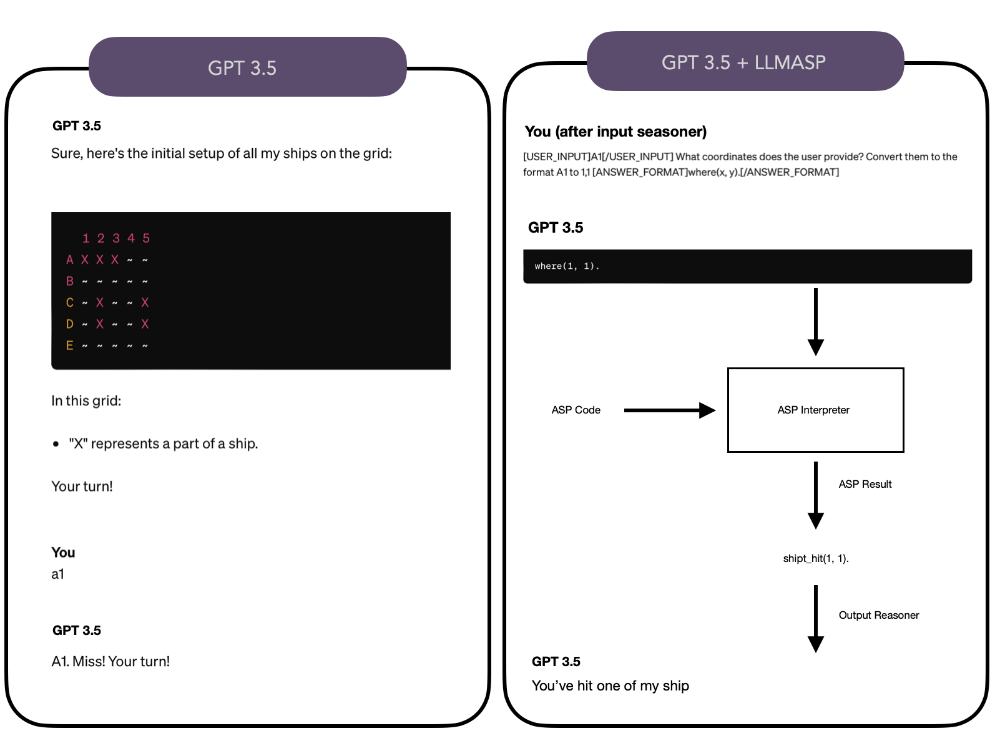

                

 
# LLMASP

LLM reasoner using ASP programming language with custom output handler. 
The output handler can be of two types:
 - Evaluator: The evaluator takes the output from the ASP solver and reason over it explaining to the user what it's happening.
 - Executor: The executor takes the output from the ASP solver and execute user defined actions over it (robot controller, battleship player).

[Valasp](https://github.com/alviano/valasp) will be used to syntax control the output of the LLM  (for now we'll use Gemini from Google as testing).

How does it work:

 
## Getting Started

These instructions will give you a copy of the project up and running on
your local machine for development and testing purposes. See deployment
for notes on deploying the project on a live system.
 
### Prerequisites

- Poetry
- LM Studio for local LLM (optional)
 
### Installing

Run:

    poetry install

in the main folder of the project

And

- Windows:

      poetry run python main.py

- Mac:

      poetry run python3 main.py

to execute the demo provided
 
## Authors

See also the list of
[contributors](https://github.com/PurpleBooth/a-good-readme-template/contributors)
who participated in this project.

- **Lorenzo Grillo** - [Xiro28](https://github.com/Xiro28)
- **Mario Alviano** - [alviano](https://github.com/alviano)

 
## Acknowledgments

- [G4F](https://github.com/xtekky/gpt4free) for the library used to  comunicate the Gemini client
- [LM Studio](https://lmstudio.ai) for the tool to inference the LLM on local hardware offline

## Original Idea (italian):

Input: testo in linguaggio naturale
 
Accoppiamo l'input con delle domande a LLM. Ogni domanda ha l'obiettivo di estrarre qualche parte dell'input e mapparla su qualche predicato.
    usiamo YAML per definire una lista di domande
    - question: str
    - predicates
        predicate con arità e tipo (usiamo valasp)
 
LLM ci fornisce una lista di fatti. Usiamo valasp per controllare la correttezza. Se ci sono errori, ripetiamo la domanda (fornendo l'errore).
 
La lista di fatti la accoppiamo con un programma ASP (base di conoscenza contestuale all'applicazione). Otteniamo un answer set (conosciamo il tipo dei predicati in output).
 
Traduciamo l'answer set in linguaggio naturale
    forniamo l'answer set al LLM + suggerimenti sulla base del tipo dei predicati e delle "domande di output"
    
----
 
Formato YAML di una applicazione:
    
preprocessing:
  - question: "What kind of restaurant are you looking for?"
    predicates:
      - restaurant
      - restaurant_kind
 
valasp:
  VALASP YAML FORMAT
 
knowledge_base:
  PROGRAMMA ASP
 
postprocessing:
  - question: "How you would describe the ordered plates?"   % arricchita con "The **ordered plates** are represented by facts on predicate **order** (argument 1 is of type string)."
    predicates:
      - order: "ordered plates"
